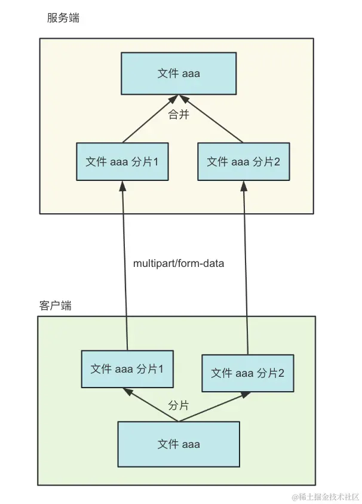

# 使用multer实现文件上传 
文件上传是常见需求，只要指定 content-type 为 multipart/form-data，内容就会以这种格式被传递到服务端：

服务端再按照 multipart/form-data 的格式提取数据，就能拿到其中的文件。

# 大文件切片上传
但当文件很大的时候，事情就变得不一样了。
假设传一个 100M 的文件需要 3 分钟，那传一个 1G 的文件就需要 30 分钟。
这样是能完成功能，但是产品的体验会很不好。
所以大文件上传的场景，需要做专门的优化。
把 1G 的大文件分割成 10 个 100M 的小文件，然后这些文件并行上传，不就快了？
然后等 10 个小文件都传完之后，再发一个请求把这 10 个小文件合并成原来的大文件。
这就是大文件分片上传的方案。

